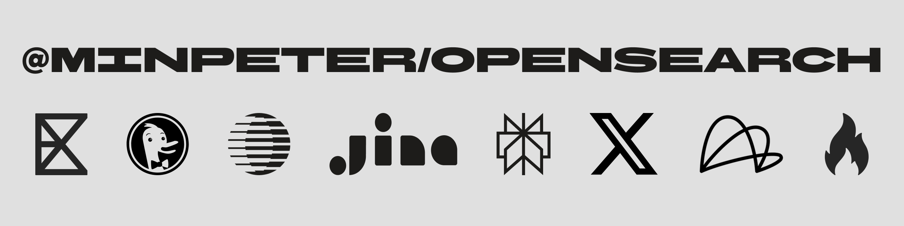

  

# opensearch

Web search and page fetch for agents and TypeScript apps.

## Packages

[`@minpeter/opensearch`](packages/opensearch/README.md) is the core runtime for
search, fetch, routing, and page extraction.

[`opensearch-mcp`](packages/opensearch-mcp/README.md) ships `web_search` and
`web_fetch` as MCP stdio tools.

[`opensearch-ai-sdk`](packages/opensearch-ai-sdk/README.md) wraps the same
search and fetch surface for the Vercel AI SDK.

## Special Thanks

Thanks to [fivetaku/insane-search](https://github.com/fivetaku/insane-search)
for the fetch fallback and anti-bot research that informed this project.

## License

MIT
